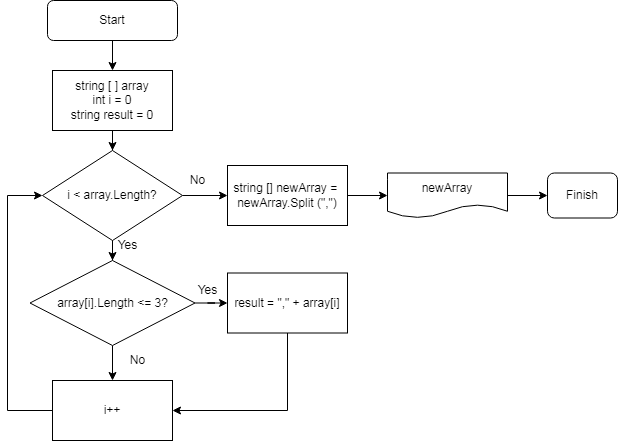

**Итоговая проверочная работа за 1 четверть**

Программа из заранее заданного массива строк создает массив, в который входят только те элементы, длина которых меньше или равна 3 символам. Затем показывает пользователю получившийся массив.

